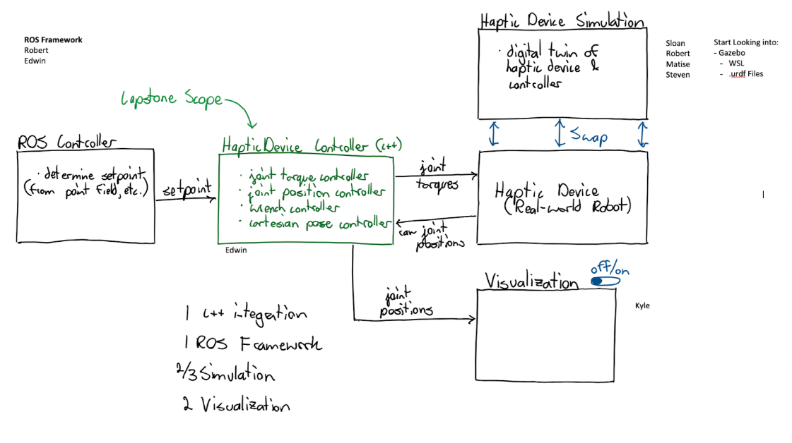

# General Overview

## Technical Requirements
- Ubuntu 24.04
- Ros2 "Jazzy Jalisco"

## Useful commands
- `colcon build` -> rebuild ros environment
- `source /opt/ros/jazzy/setup.bash`-> run to allow ros to be used in terminal
- `source install/setup.bash` -> run first time a terminal is used, or when packages are updated
- `ros2 topic list` -> list topics

## How to test basic system
In top lvl workspace:
- `colcon build`
In 4 different top lvl workspace terminals:
- `source /opt/ros/jazzy/setup.bash`
- `source install/setup.bash`
Now run 1 module in each of those terminals
- `ros2 run haptic_sim_pkg capstone_controller`
- `ros2 run haptic_sim_pkg user_controller`
- `ros2 run haptic_sim_pkg simulator`
- `ros2 run haptic_sim_pkg visualization`

Visual summary:

